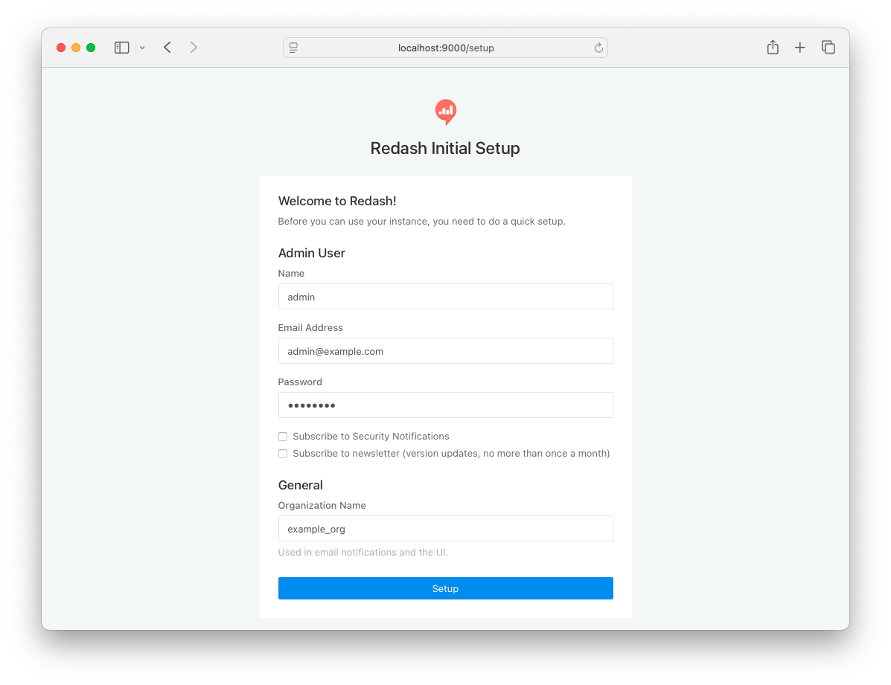
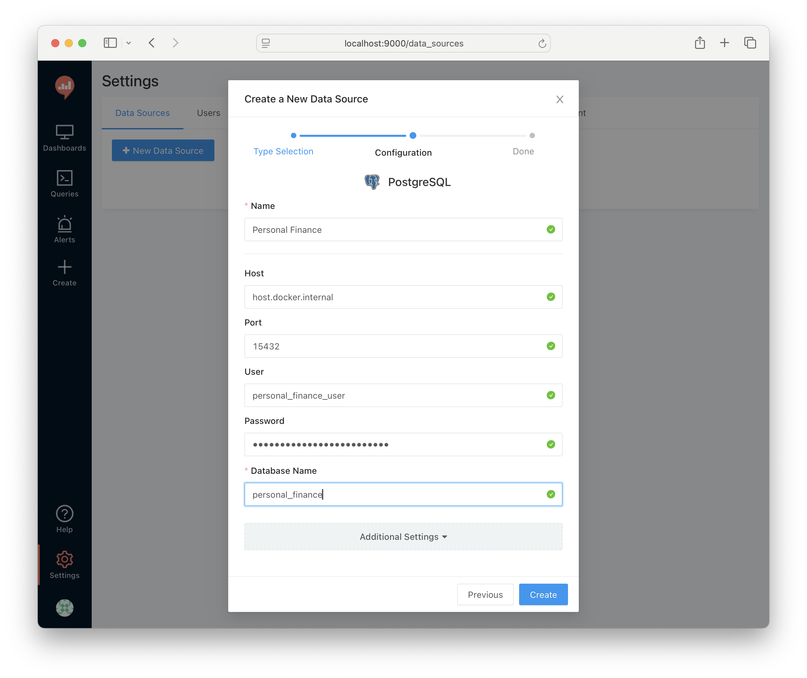

# personal-expense-tracker

This is an open source personal expense tracking application.

## Table of Content

* [Prerequisite](#prerequisite)
* [Getting Started](#getting-started)
    * [Clone the repository](#clone-the-repository)
    * [Setup the virtual environment](#setup-the-virtual-environment)
    * [Install the packages](#install-the-packages)
    * [Start the docker containers](#start-the-docker-containers)
    * [Database migrations](#database-migrations)

## Prerequisite

* Python >= 3.11
* Git
* Docker (any one: Docker Desktop, Colima, Rancher Desktop, etc.)

## Getting Started

### Clone the repository

```shell
git clone https://github.com/yusufshakeel/personal-finance.git
```

### Setup the virtual environment

```shell
python3 -m venv .venv
```

Then run

```shell
source ./.venv/bin/activate
```

### Install the packages

```shell
pip install -r requirements.txt
```

### Create `.env` file from `.env.example` file

```shell
cp .env.example .env
```

### Create Redash database and tables.

First time setup.

```shell
docker compose run --rm server create_db
```

Output

```text
docker compose run --rm server create_db
[+] Creating 5/5
 ✔ Network personal-expense-tracker_default       Created                                                                                             0.0s
 ✔ Volume redash_postgres_data                    Created                                                                                             0.0s
 ✔ Volume redash_redis_data                       Created                                                                                             0.0s
 ✔ Container personal-expense-tracker-postgres-1  Created                                                                                             0.1s
 ✔ Container personal-expense-tracker-redis-1     Created                                                                                             0.1s
[+] Running 2/2
 ✔ Container personal-expense-tracker-postgres-1  Started                                                                                             0.2s
 ✔ Container personal-expense-tracker-redis-1     Started                                                                                             0.3s
[2026-02-08 14:11:21,182][PID:1][INFO][xmlschema] Include schema from 'file:///usr/local/lib/python3.10/site-packages/xmlschema/schemas/XSD_1.1/xsd11-extra.xsd'
[2026-02-08 14:11:22,360][PID:1][INFO][alembic.runtime.migration] Context impl PostgresqlImpl.
[2026-02-08 14:11:22,360][PID:1][INFO][alembic.runtime.migration] Will assume transactional DDL.
[2026-02-08 14:11:22,379][PID:1][INFO][alembic.runtime.migration] Running stamp_revision  -> db0aca1ebd32
```

### Start docker containers

```shell
docker compose up -d
```

### Setup Redash

Now, open [http://localhost:9000/setup](http://localhost:9000/setup) in your browser and setup Redash.

Example:
```text
Admin Name: Admin
Admin Email Address: admin@example.com
Admin Password: root1234
General Organization Name: Example Org
```



### Add a new data source in Redash

After log in,
- Go to Settings and Click "New Data Source" [http://localhost:9000/data_sources](http://localhost:9000/data_sources)
- Select the Type: PostgreSQL
- Set the Name=Personal Finance
- Set the Host=host.docker.internal
- Set the Port=15432
- Set the User=personal_finance_user
- Set the Password=personal_finance_password
- Set the Database Name=personal_finance
- Click the "Create" button



### Database migrations

This project uses `alembic`. Run the following command in the terminal to perform database migrations.

```shell
alembic upgrade head
```

## Force teardown

```shell
docker compose down --volumes --remove-orphans
docker volume prune -f
docker container prune -f
```
